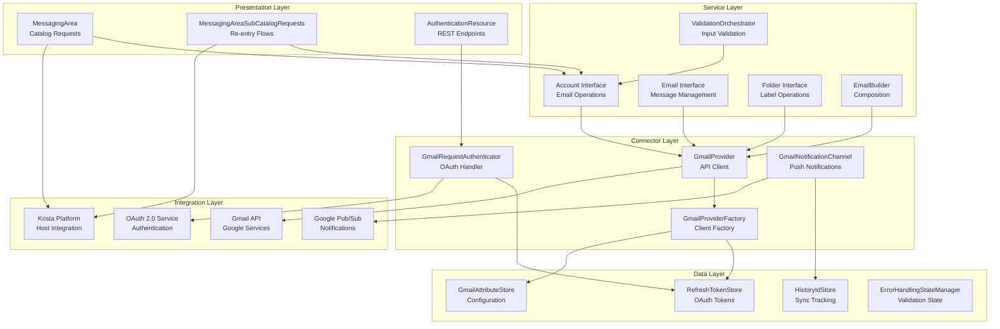
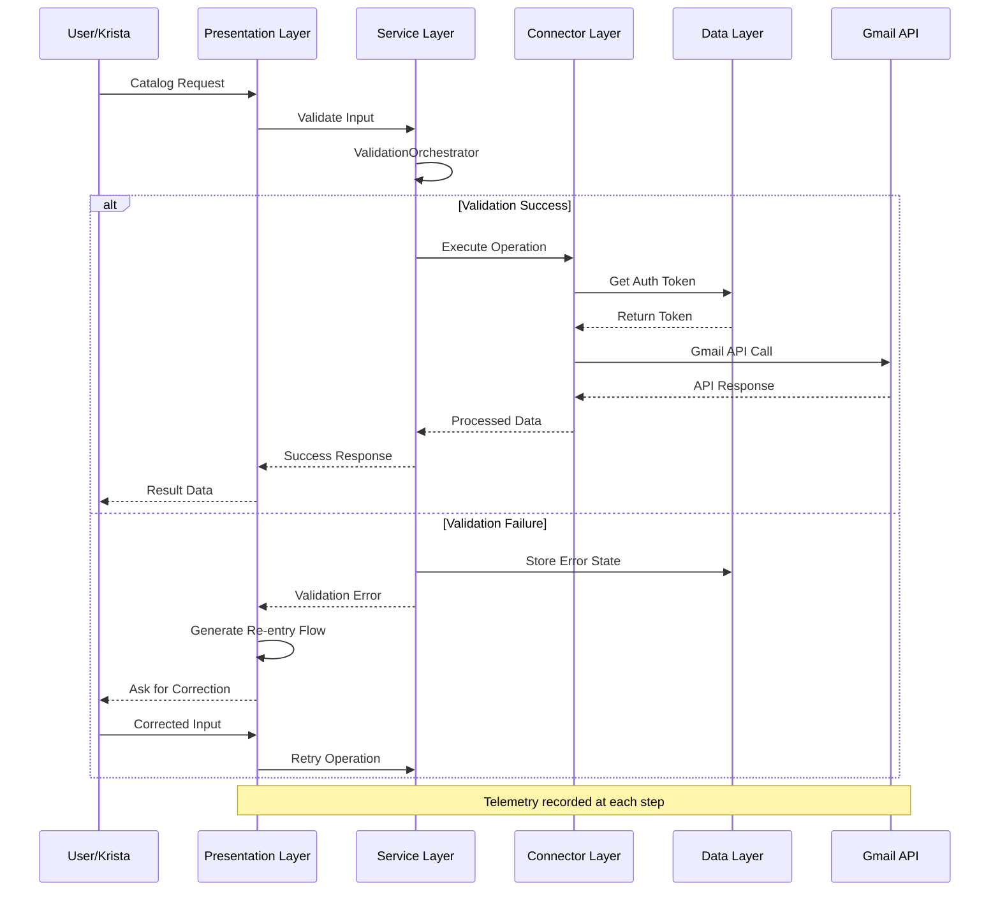
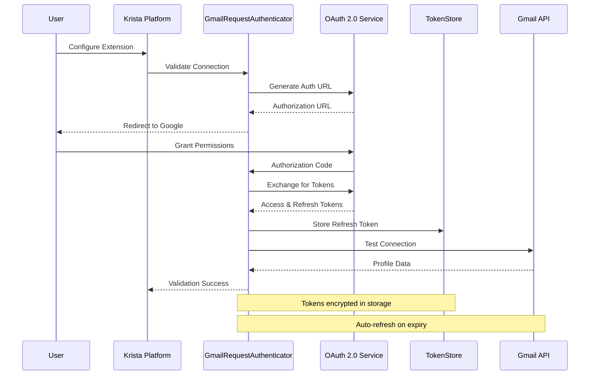
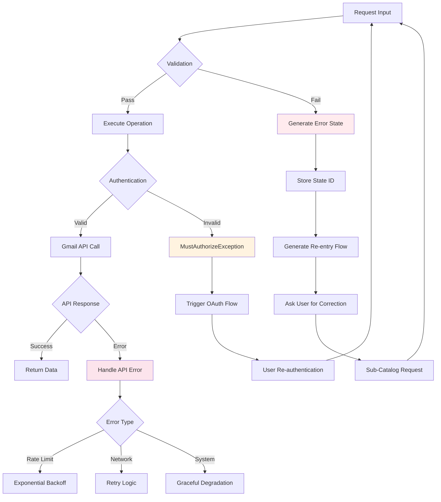
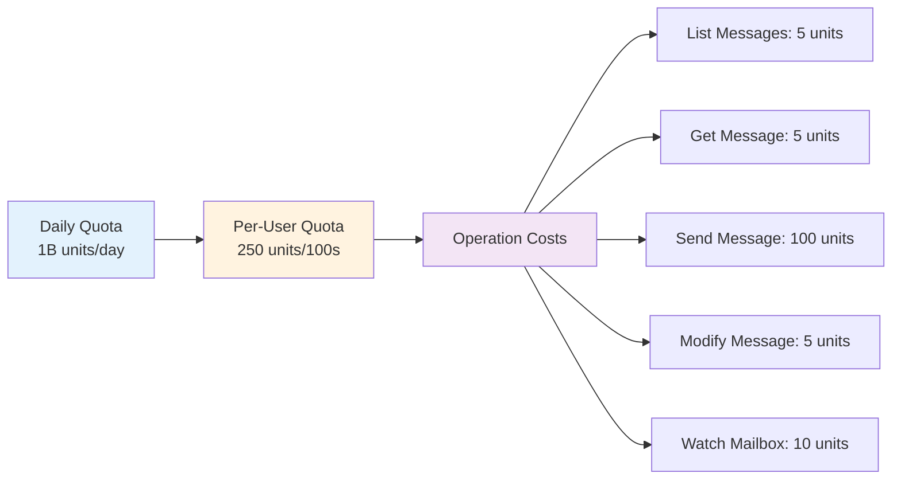
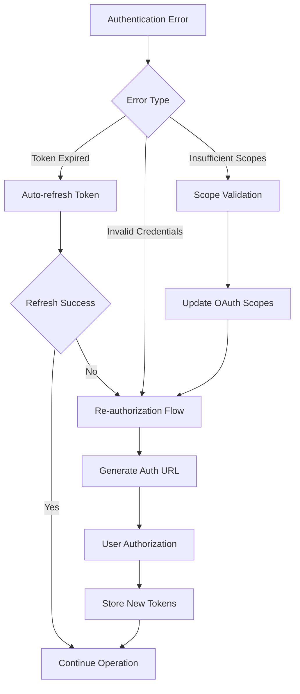
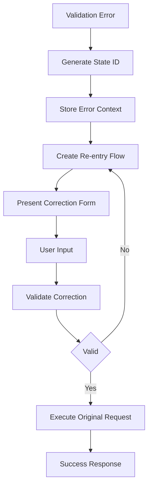
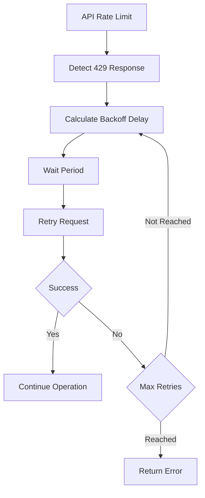

# Gmail Extension Architecture Documentation

## Table of Contents
1. [Overview](#overview)
2. [5-Layer Architecture](#5-layer-architecture)
3. [Component Architecture](#component-architecture)
4. [Data Flow Architecture](#data-flow-architecture)
5. [Authentication Flow](#authentication-flow)
6. [Error Handling Architecture](#error-handling-architecture)
7. [Performance Limitations](#performance-limitations)
8. [Error Scenarios](#error-scenarios)
9. [Integration Patterns](#integration-patterns)

## Overview

The Gmail Extension follows a sophisticated 5-layer architecture pattern designed for scalability, maintainability, and robust error handling. The extension integrates with Gmail API, OAuth 2.0 authentication, Google Pub/Sub notifications, and the Krista platform ecosystem.

### Key Architectural Principles
- **Separation of Concerns**: Clear layer boundaries with specific responsibilities
- **Dependency Injection**: HK2-based service management
- **Event-Driven Architecture**: Real-time notifications via webhooks
- **Comprehensive Error Handling**: Multi-level validation and recovery
- **Performance Optimization**: Pagination, caching, and resource management

## 5-Layer Architecture



### Layer Responsibilities

#### 1. Presentation Layer
- **MessagingArea**: Primary catalog requests (15 main operations)
- **MessagingAreaSubCatalogRequests**: Validation error recovery and re-entry flows
- **AuthenticationResource**: REST endpoints for OAuth callbacks and webhooks

#### 2. Service Layer
- **Account Interface**: High-level email account operations
- **Email Interface**: Individual email message management
- **Folder Interface**: Gmail label/folder operations
- **EmailBuilder**: Fluent API for email composition
- **ValidationOrchestrator**: Centralized input validation

#### 3. Connector Layer
- **GmailProvider**: Gmail API client management and authentication
- **GmailProviderFactory**: Factory pattern for provider creation
- **GmailRequestAuthenticator**: OAuth 2.0 flow handling
- **GmailNotificationChannel**: Push notification management

#### 4. Data Layer
- **RefreshTokenStore**: Secure OAuth token persistence
- **GmailAttributeStore**: Extension configuration storage
- **HistoryIdStore**: Gmail history tracking for synchronization
- **ErrorHandlingStateManager**: Validation state management

#### 5. Integration Layer
- **Gmail API**: Google's REST API for email operations
- **OAuth 2.0 Service**: Google authentication service
- **Google Pub/Sub**: Real-time notification delivery
- **Krista Platform**: Host platform integration and services

## Component Architecture

```mermaid
graph LR
    subgraph "Gmail Extension Core"
        A[GmailExtension<br/>@Extension<br/>Version 2.0.12]
        B[GmailAttributes<br/>@Service<br/>Configuration]
        C[GmailApplication<br/>@ApplicationPath<br/>REST Config]
    end
    
    subgraph "Validation Framework"
        D[ValidationOrchestrator<br/>@Service]
        E[MessageIdValidator]
        F[EmailValidators<br/>TO/CC/BCC/ReplyTo]
        G[PaginationValidators<br/>Page/Size]
        H[QueryValidator]
        I[LabelValidator]
    end
    
    subgraph "Telemetry & Monitoring"
        J[TelemetryHelper<br/>@Service]
        K[TelemetryMetrics<br/>Platform Service]
    end
    
    subgraph "Error Management"
        L[ExtensionResponseGenerator<br/>@Service]
        M[ErrorHandlingStateManager<br/>@Service]
        N[MustAuthorizeException<br/>Auth Errors]
    end
    
    A --> B
    A --> C
    D --> E
    D --> F
    D --> G
    D --> H
    D --> I
    J --> K
    L --> M
    
    style A fill:#e1f5fe
    style D fill:#f3e5f5
    style J fill:#e8f5e8
    style L fill:#fff3e0
```

## Data Flow Architecture



## Authentication Flow



## Error Handling Architecture



### Error Types and Handling

#### 1. Validation Errors
- **Input Validation**: Email format, pagination bounds, message ID existence
- **Recovery**: Guided re-entry flows with specific error messages
- **State Management**: Temporary state storage for retry operations

#### 2. Authentication Errors
- **MustAuthorizeException**: OAuth token expired or invalid
- **Recovery**: Automatic re-authorization flow
- **User Experience**: Seamless re-authentication prompts

#### 3. API Errors
- **Rate Limiting**: Gmail API quota exceeded
- **Network Errors**: Connection timeouts, DNS failures
- **Service Errors**: Gmail service unavailable
- **Recovery**: Exponential backoff, retry strategies

#### 4. System Errors
- **Memory Constraints**: Large email processing limits
- **Storage Errors**: Token store unavailability
- **Configuration Errors**: Invalid extension setup
- **Recovery**: Graceful degradation with user notification

## Performance Limitations

### Gmail API Quotas


### Pagination Constraints
- **Maximum Page Size**: 15 emails per request
- **Maximum Pages**: 15 pages per operation
- **Total Email Limit**: 225 emails per catalog request
- **Rationale**: Balance API efficiency with memory usage

### Memory and Resource Limits
- **Attachment Size**: 25 MB per email (Gmail API limitation)
- **Email Caching**: Minimal caching to reduce memory footprint
- **Connection Pooling**: Reuse HTTP connections for efficiency
- **Timeout Configuration**: Optimized timeout values

### Performance Optimization Strategies
- **Streaming**: Large attachments streamed rather than loaded
- **Pagination**: Prevents loading large email sets simultaneously
- **Caching Strategy**: Cache folder lists (5 min), user profiles (1 hour)
- **Garbage Collection**: Prompt cleanup of temporary objects

## Error Scenarios

### Common Error Scenarios and Resolutions

#### 1. Authentication Failures


#### 2. Validation Error Recovery


#### 3. Rate Limiting Handling


## Integration Patterns

### Event-Driven Integration
- **Gmail Webhooks**: Real-time email notifications via Google Pub/Sub
- **History API**: Efficient change detection and synchronization
- **Event Processing**: Asynchronous handling of email events

### Service Integration
- **Dependency Injection**: HK2 container for service management
- **Factory Pattern**: GmailProviderFactory for client creation
- **Observer Pattern**: Event listeners for real-time updates

### Data Integration
- **Entity Mapping**: Convert Gmail API responses to Krista entities
- **Type Conversion**: Handle different data types and formats
- **Attachment Processing**: Convert between Krista Files and Java Files

This architecture ensures robust, scalable, and maintainable Gmail integration with comprehensive error handling and performance optimization.
