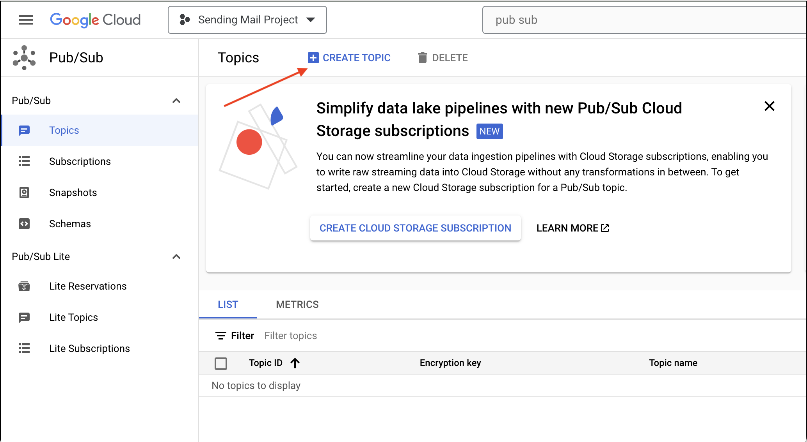
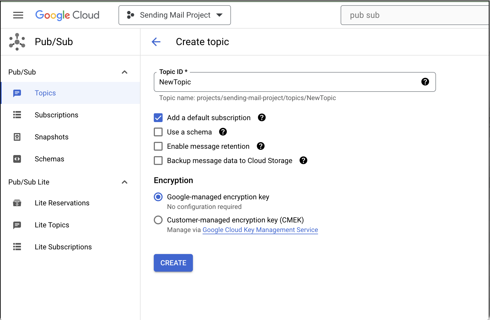
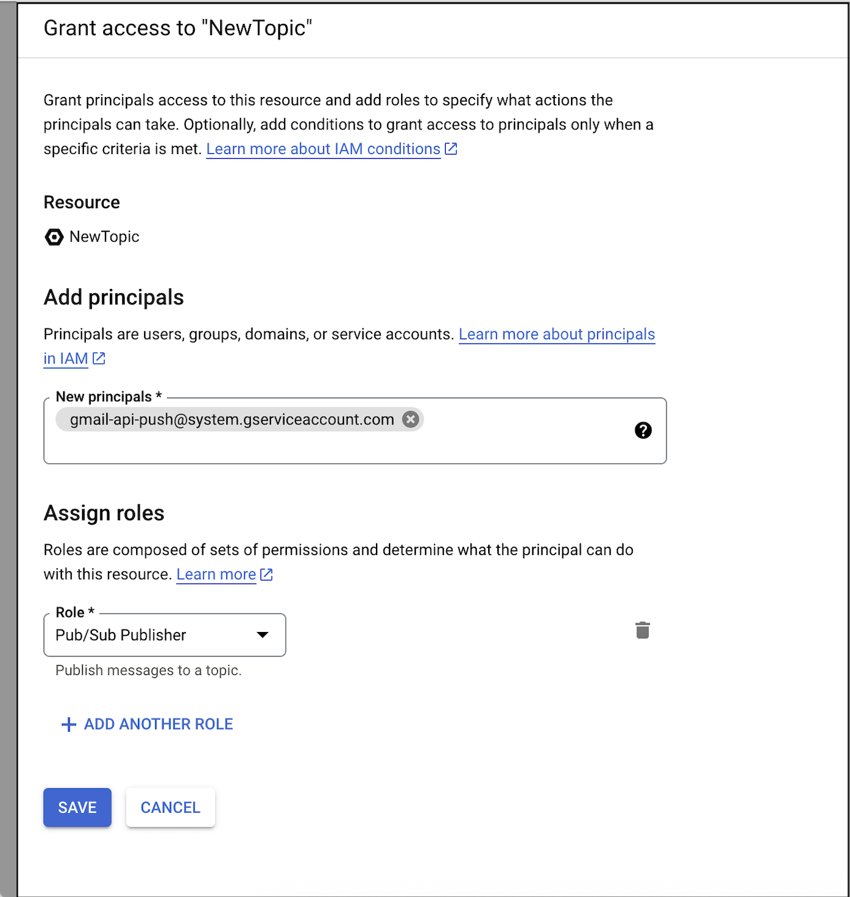
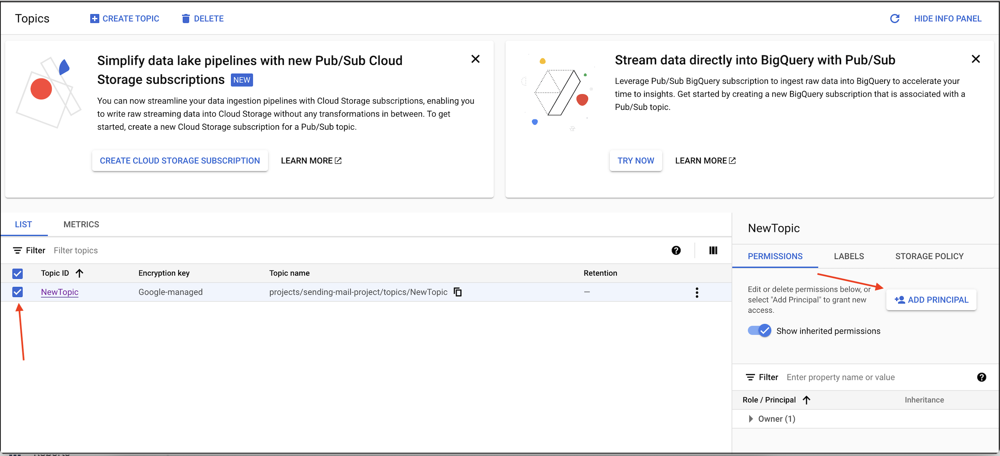
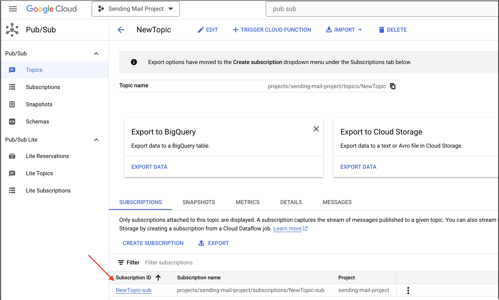
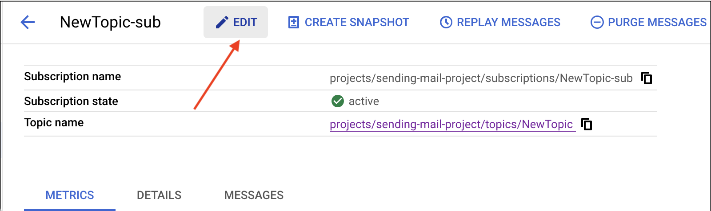
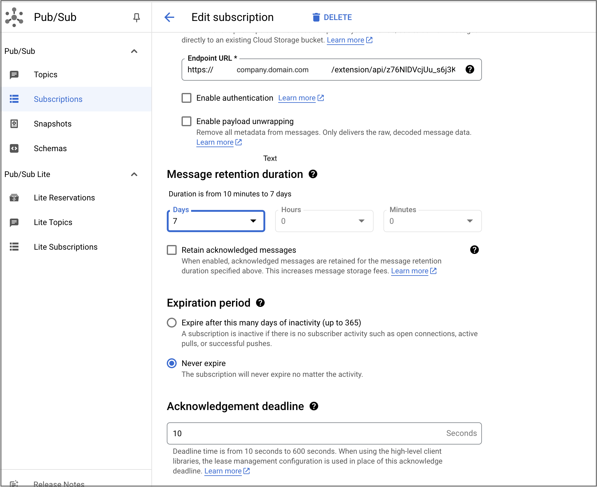

# Creating Gmail Agent with Pub/Sub Integration

## Overview

This guide provides step-by-step instructions for setting up a Gmail Agent with Google Cloud Pub/Sub integration. This setup enables real-time email notifications and webhook processing for the Gmail Extension. By following this guide, you'll create the necessary Pub/Sub topics and subscriptions to enable seamless Gmail integration.

## Prerequisites

Before you begin, ensure you have:

- A Google Cloud project with billing enabled
- Access to [Google Cloud Console](https://console.cloud.google.com/)
- Gmail API enabled in your project
- Appropriate IAM permissions for Pub/Sub operations
- The Gmail Extension deployed and accessible via webhook URL

## Step-by-Step Instructions

### Step 1: Navigate to Pub/Sub Service

1. Open the Google Cloud Console and navigate to your project
2. Search for "Pub/Sub" in the search bar or navigate through the services menu
3. Select "Topics" from the left-hand navigation pane to access the Pub/Sub Topics section

*Navigate to the Pub/Sub service in Google Cloud Console*

### Step 2: Create a New Topic

1. **Initiate Topic Creation:**
   - Click the **"Create Topic"** button to start creating a new Pub/Sub topic
   - This will open the topic creation dialog

*Click "Create Topic" to start the topic creation process*

2. **Configure Topic Details:**
   - In the **"Topic ID"** field, enter a unique and descriptive name for your topic
   - Recommended naming convention: `gmail-notifications-{environment}` (e.g., `gmail-notifications-prod`)
   - Leave the remaining options with their default settings for standard use cases
   - Click **"Create"** to create your Pub/Sub topic

*Enter a descriptive topic ID and configure topic settings*

### Step 3: Configure Topic Permissions

1. **Select Your Topic:**
   - In the Pub/Sub Topics list, locate the topic you just created
   - Check the checkbox next to your topic to select it

2. **Add Principal Access:**
   - Click **"Add Principal"** to configure access permissions
   - Enter the service account email  **`gmail-api-push@system.gserviceaccount.com`** that will publish messages to this topic
   - Assign appropriate roles (typically `Pub/Sub Publisher` for the Gmail service)

*Add principal access to allow message publishing to the topic*

*Configure the principal details and assign appropriate roles*

### Step 4: Create and Configure Subscription

1. **Access Topic Details:**
   - Click on the name of your topic to open the topic details page
   - Navigate to the **"Subscriptions"** section

*Click on the topic name to access subscription management*

2. **Edit Subscription Settings:**
   - Locate the subscription ID in the list
   - Click **"Edit"** to modify subscription configuration

*Click "Edit" to configure subscription settings*

### Step 5: Configure Webhook Endpoint

1. **Select Push Delivery Type:**
   - In the subscription configuration screen, set **Delivery type** to **Push**
   - This enables Google Pub/Sub to deliver messages directly to your HTTPS endpoint

2. **Set Endpoint URL:**
   - In the **"Endpoint URL"** field, enter your Gmail Extension webhook URL
   - Format: `<Extension Base URL>/rest/gmail/webhook`
   - Ensure the URL is accessible from Google Cloud and properly configured for webhook processing

*Configure the webhook endpoint URL for message delivery*

### Step 6: Configure Retention and Expiration Settings

1. **Message Retention Duration:**
   - Set Message Retention Duration up to **7 days** maximum
   - This ensures messages are retained for processing even if the webhook is temporarily unavailable

2. **Subscription Expiration:**
   - Set Expiration Period to **"Never expire"** (recommended for production)
   - Alternatively, set up to maximum **365 days** if organizational policies require expiration
   - This prevents automatic deletion of subscriptions during periods of inactivity

*Configure message retention and subscription expiration settings*

## Verification and Testing

### Verify Configuration

1. **Check Topic Status:**
   - Ensure the topic shows as "Active" in the Topics list
   - Verify that the correct principals have been added with appropriate permissions

2. **Validate Subscription:**
   - Confirm the subscription is properly configured with the correct endpoint URL
   - Check that retention and expiration settings match your requirements

3. **Test Webhook Connectivity:**
   - Send a test message to verify the webhook endpoint is receiving notifications
   - Monitor the subscription metrics to ensure messages are being delivered successfully

## Troubleshooting

### Common Issues

- **Permission Denied**: Ensure the service account has `Pub/Sub Publisher` role
- **Webhook Not Receiving Messages**: Verify the endpoint URL is correct and accessible
- **Subscription Expiring**: Check expiration settings and extend if necessary

### Best Practices

- Use descriptive topic and subscription names
- Set appropriate retention periods based on your processing requirements
- Monitor subscription health and message delivery metrics
- Implement proper error handling in your webhook endpoint

## Conclusion

You have successfully created a Gmail Agent with Pub/Sub integration! Your setup now includes:

✅ **Pub/Sub Topic** - Ready to receive Gmail notification messages
✅ **Configured Permissions** - Proper access controls for message publishing
✅ **Active Subscription** - Webhook endpoint configured for message delivery
✅ **Retention Settings** - Appropriate message retention and expiration policies

Your Gmail Extension can now receive real-time notifications through the configured Pub/Sub infrastructure.
