# Creating Gmail App

## Overview

This guide provides step-by-step instructions for creating a Google Cloud project, enabling the Gmail API, and configuring OAuth 2.0 credentials required for the Gmail Extension. By following this guide, you'll set up everything needed to authenticate and integrate with Gmail.

## Prerequisites

Before you begin, ensure you have:

- A Google account (personal or Google Workspace)
- Access to [Google Cloud Console](https://console.cloud.google.com/)
- Administrative privileges to create projects (for organizations)
- A valid credit card (for Google Cloud account verification, though Gmail API is free)

## Step-by-Step Instructions

### Step 1: Create a Google Cloud Project

1. Navigate to [Google Cloud Console](https://console.cloud.google.com/)
2. Click the project dropdown at the top of the page

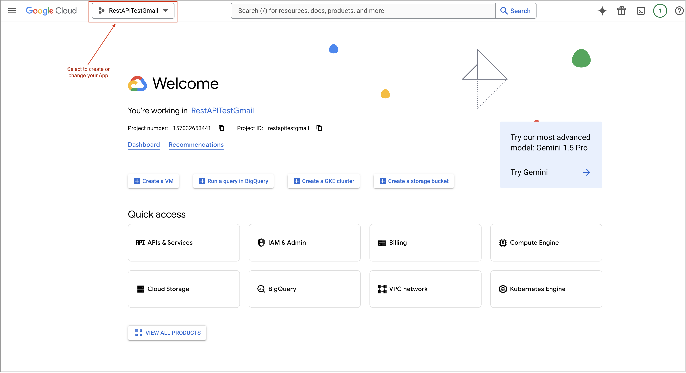
*Click on the project dropdown to create a new project*

3. Click **"New Project"** in the dialog that appears

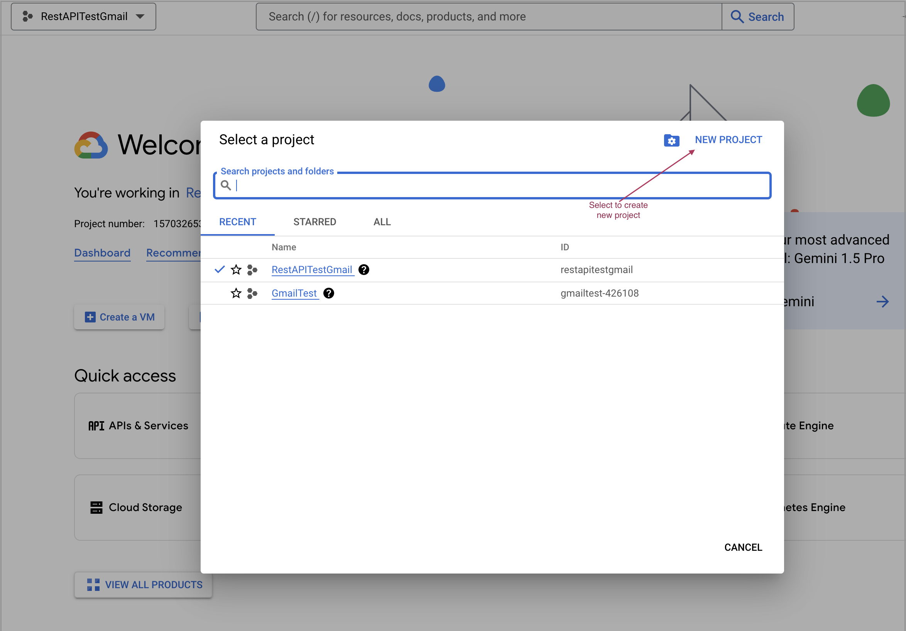
*Click "New Project" to start creating a new Google Cloud project*

4. Enter project details:
   - **Project Name**: Enter a descriptive name (e.g., "Krista Gmail Integration")
   - **Organization**: Select your organization (if applicable)
   - **Location**: Choose the appropriate organization or "No organization"

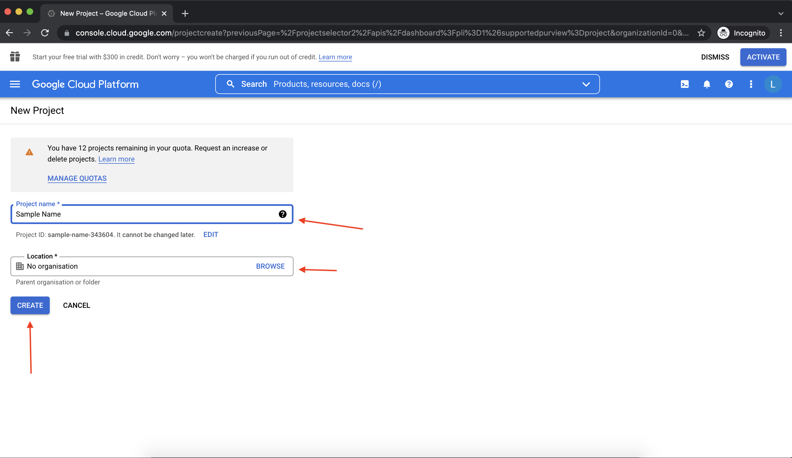
*Enter your project name and organization details*

5. Click **"Create"**
6. Wait for the project to be created (usually takes a few seconds)
7. Select the newly created project from the project dropdown

### Step 2: Enable Gmail API

1. In the Google Cloud Console, ensure your project is selected
2. Navigate to **"APIs & Services"** > **"Library"** from the left menu

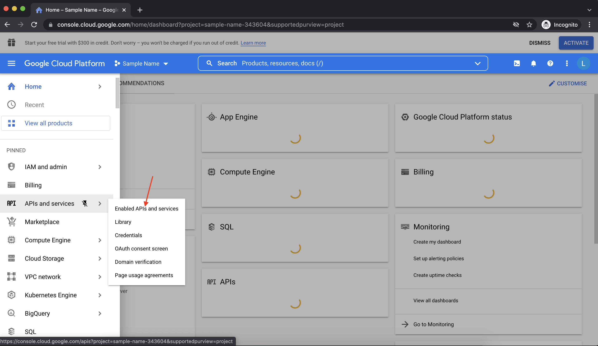
*Navigate to APIs & Services from the left menu*

3. In the search bar, type **"Gmail API"**
4. Click on **"Gmail API"** from the search results

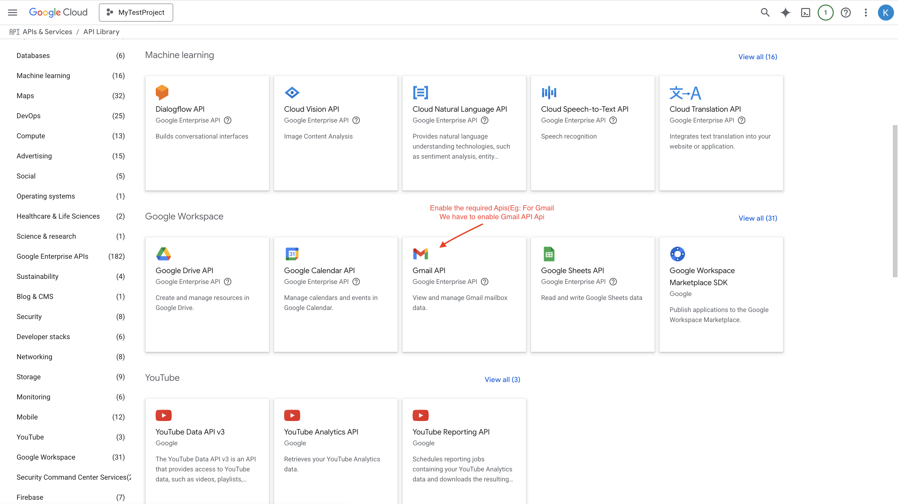
*Search for Gmail API in the library*

5. Click the **"Enable"** button

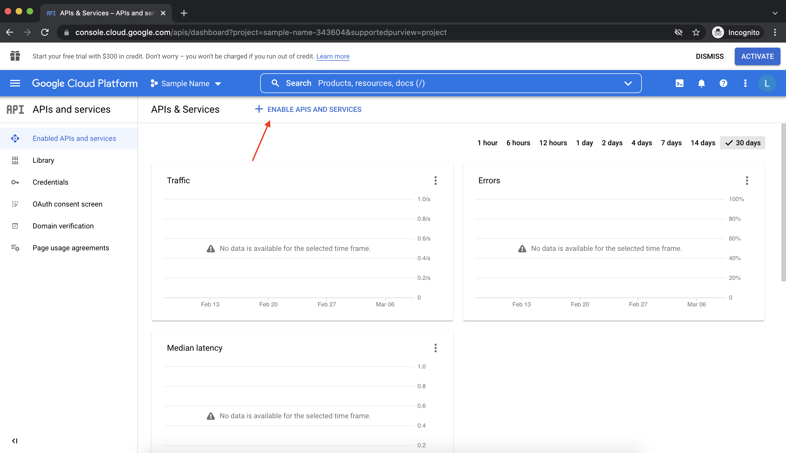
*Click Enable to activate the Gmail API for your project*

6. Wait for the API to be enabled (usually instant)
7. You'll be redirected to the API dashboard

**Verification**: You should see "Gmail API" listed under **"APIs & Services"** > **"Enabled APIs & services"**

### Step 3: Configure OAuth Consent Screen

The OAuth consent screen is what users see when they grant permissions to your application.

#### Choose User Type

1. Navigate to **"APIs & Services"** > **"OAuth consent screen"**

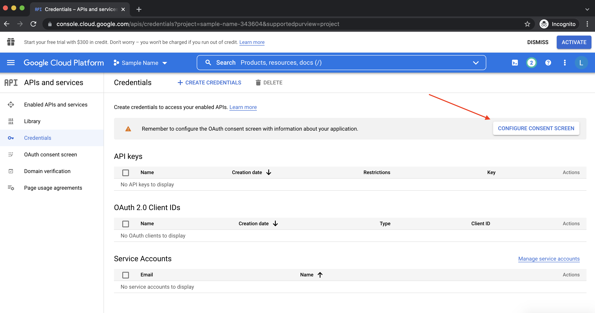
*Navigate to OAuth consent screen configuration*

2. Select user type:
   - **Internal**: For Google Workspace organizations only (users within your organization)
   - **External**: For anyone with a Google account

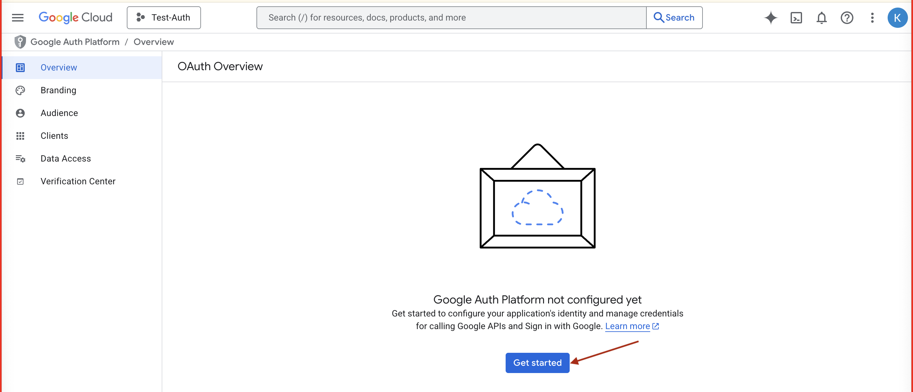


3. Click **"Get started"**

#### Configure App Information

1. **App Information**:
   - **App name**: Enter a user-friendly name (e.g., "Krista Gmail Extension")
   - **User support email**: Select your email address
   - **App logo**: (Optional) Upload a logo (120x120 pixels)

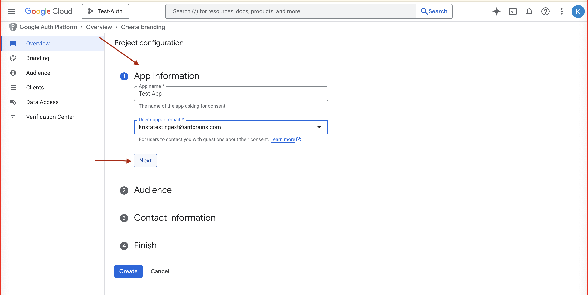

*Choose between Internal or External user type*
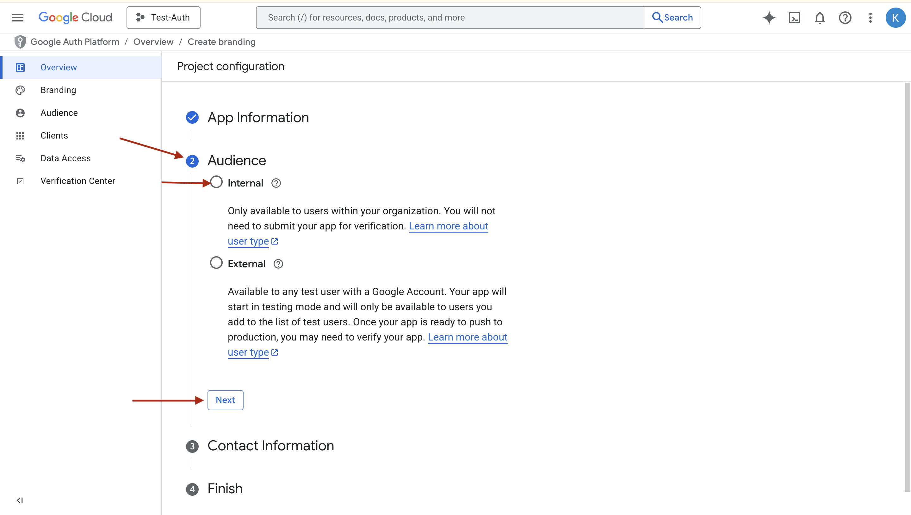


2. **App Domain** (Optional but recommended):
   - **Application home page**: Your organization's website
   - **Application privacy policy link**: Link to privacy policy
   - **Application terms of service link**: Link to terms of service

3. **Authorized Domains**:
   - Add your Krista instance domain (e.g., `yourcompany.com`)
   - This restricts where OAuth redirects can go

*Configure authorized domains and other app details*

4. **Developer Contact Information**:
   - **Email addresses**: Enter contact email(s) for Google to reach you


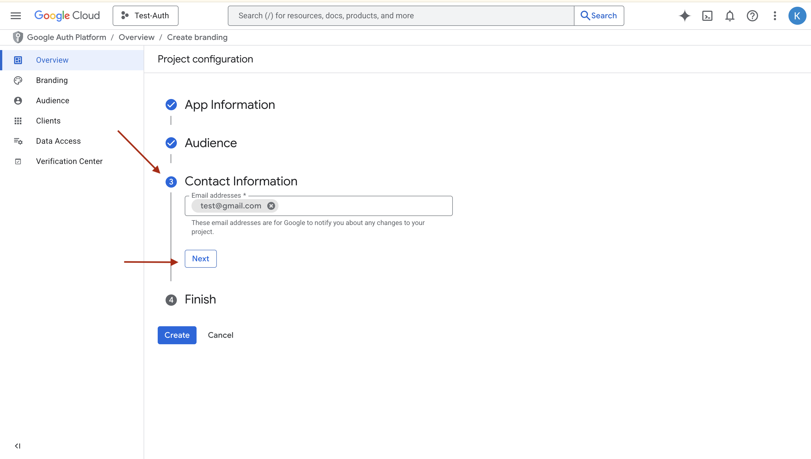
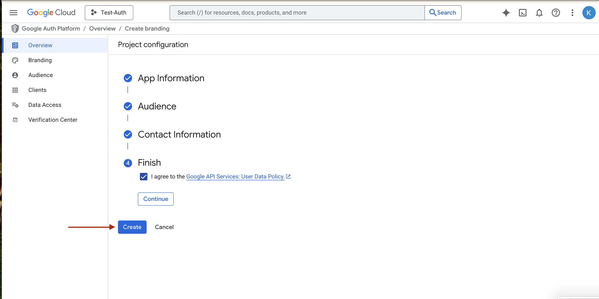

5. Click **"Create"**

#### Configure Scopes

1. Click **"Add or Remove Scopes"**

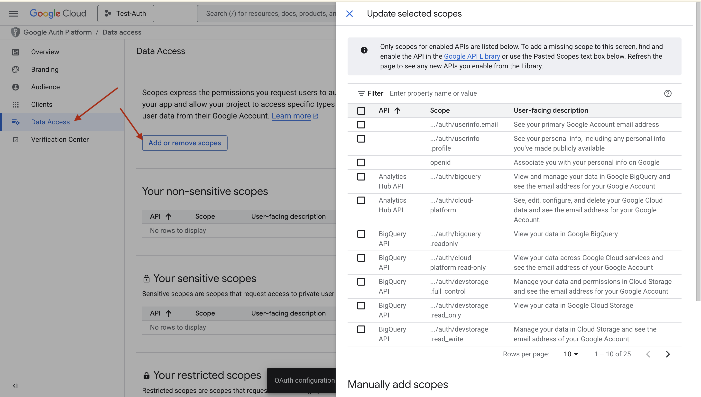
*Click "Add or Remove Scopes" to configure permissions*

2. In the filter box, search for **"Gmail API"**
3. Select the following scopes:
   - `https://www.googleapis.com/auth/gmail.modify` (Read, compose, send, and permanently delete all your email from Gmail)
   - `https://www.googleapis.com/auth/gmail.send` (Send email on your behalf)
   - `https://www.googleapis.com/auth/gmail.readonly` (View your email messages and settings)
   - `https://www.googleapis.com/auth/gmail.labels` (Manage mailbox labels)

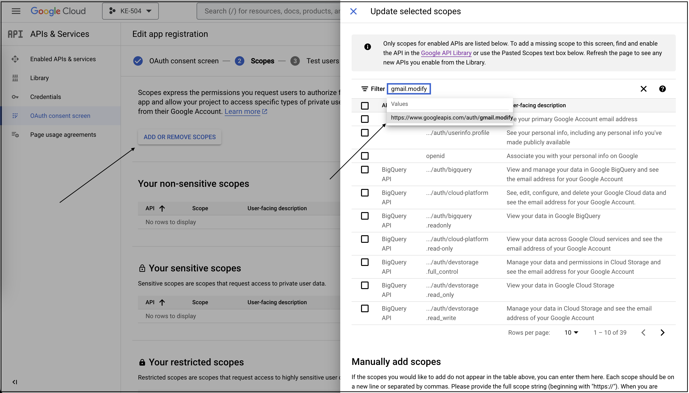
*Select the required Gmail API scopes*

4. Click **"Update"**
5. Review the selected scopes

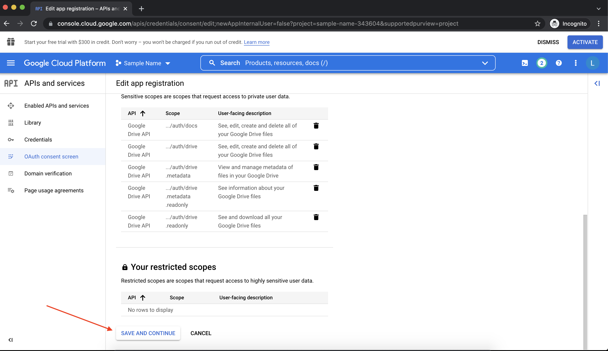
*Review and save the selected OAuth consent screen scopes*

6. Click **"Save and Continue"**

**Important**: The primary scope used by the extension is `gmail.modify`, which provides comprehensive access for most operations.

#### Add Test Users (For External Apps in Testing)

If you selected "External" and your app is in testing mode:

1. Click **"Add Users"**
2. Enter email addresses of users who should have access during testing

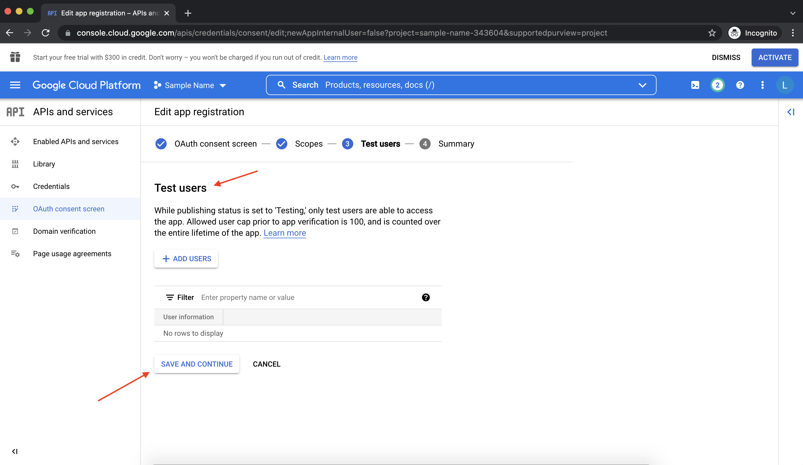
*Add test users who can access the app during testing*

3. Click **"Add"**
4. Click **"Save and Continue"**

**Note**: Testing mode limits you to 100 test users and refresh tokens expire after 7 days.

#### Review and Confirm

1. Review all the information you've entered

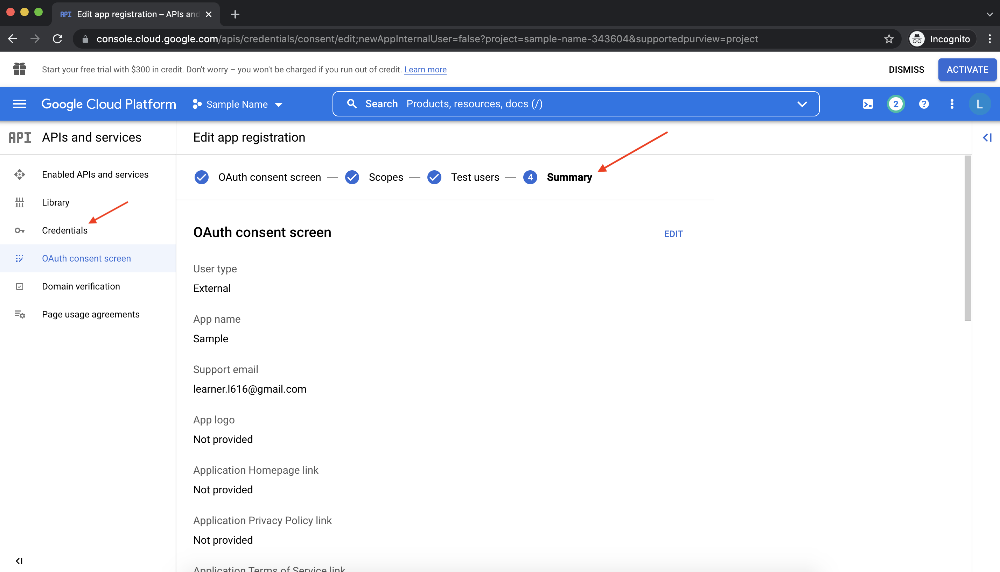
*Review the OAuth consent screen summary*

2. Click **"Back to Dashboard"**

### Step 4: Create OAuth 2.0 Credentials

1. Navigate to **"APIs & Services"** > **"Credentials"**

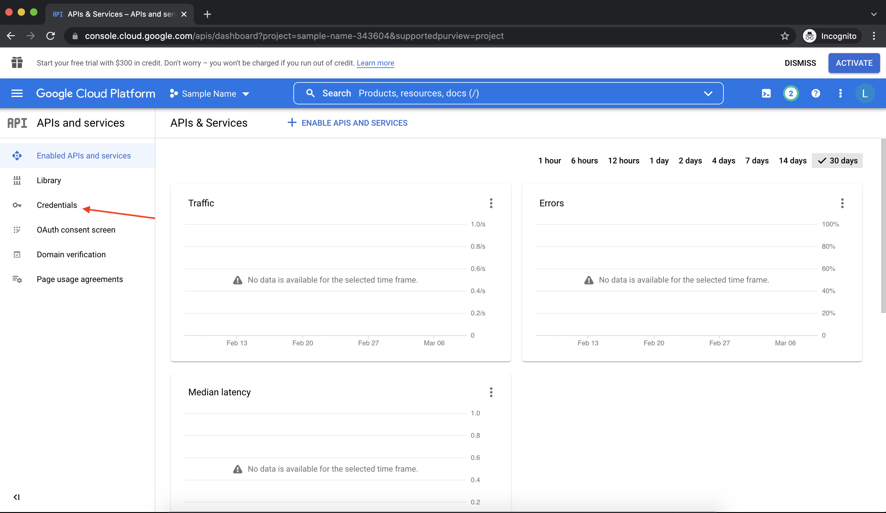
*Navigate to Credentials and click "Create Credentials"*

2. Click **"Create Credentials"** at the top
3. Select **"OAuth client ID"**

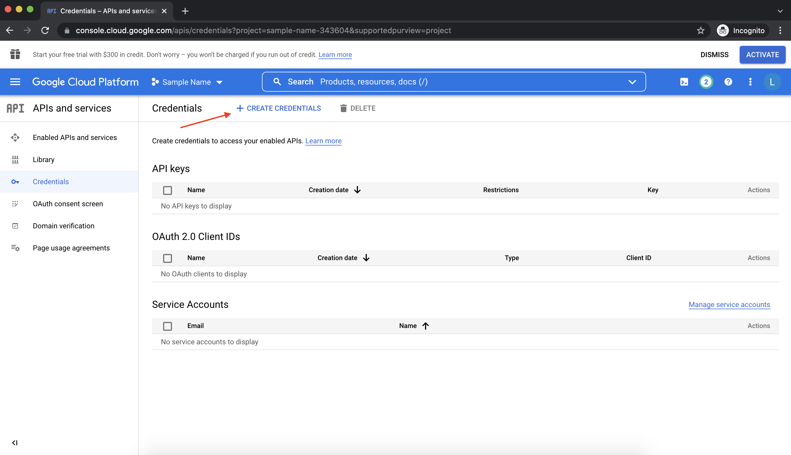
*Select "OAuth client ID" from the dropdown*

4. Configure the OAuth client:
   - **Application type**: Select **"Web application"**
   - **Name**: Enter a descriptive name (e.g., "Krista Gmail OAuth Client")

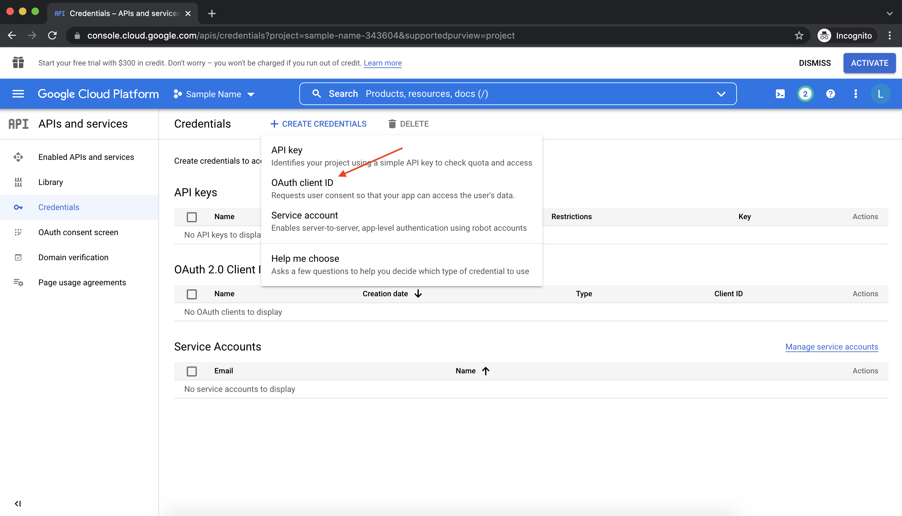
*Select "Web application" as the application type*

5. **Authorized JavaScript origins** (Optional):
   - Add your Krista instance URL (e.g., `https://automation.yourcompany.com`)

6. **Authorized redirect URIs** (Required):
   - Click **"Add URI"**
   - Enter your Gmail extension callback URL
   - Format: `<Extension Base URL>/rest/gmail/callback`
   - Example: If your Extension Base URL is
     `https://automation.yourcompany.com/extensions/gmail-abc123`, then use
     `https://automation.yourcompany.com/extensions/gmail-abc123/rest/gmail/callback`
   - **Important**: The URI must exactly match (including trailing slashes)

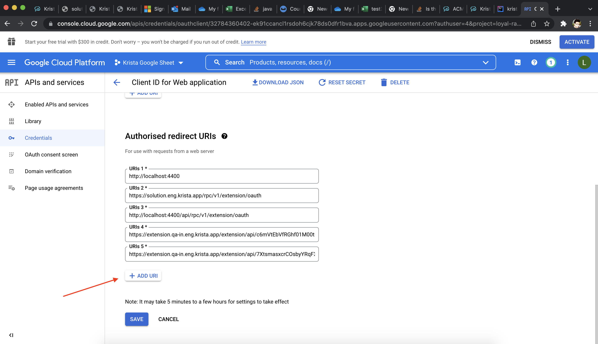
*Configure authorized redirect URIs*

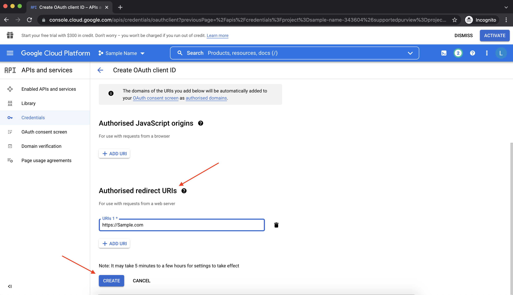
*Add your Krista OAuth callback URL*

7. Click **"Create"**

8. **Save Your Credentials**:
   - A dialog will appear with your **Client ID** and **Client Secret**
   - **Client ID**: Looks like `123456789-abc123.apps.googleusercontent.com`
   - **Client Secret**: Looks like `GOCSPX-abc123def456ghi789`

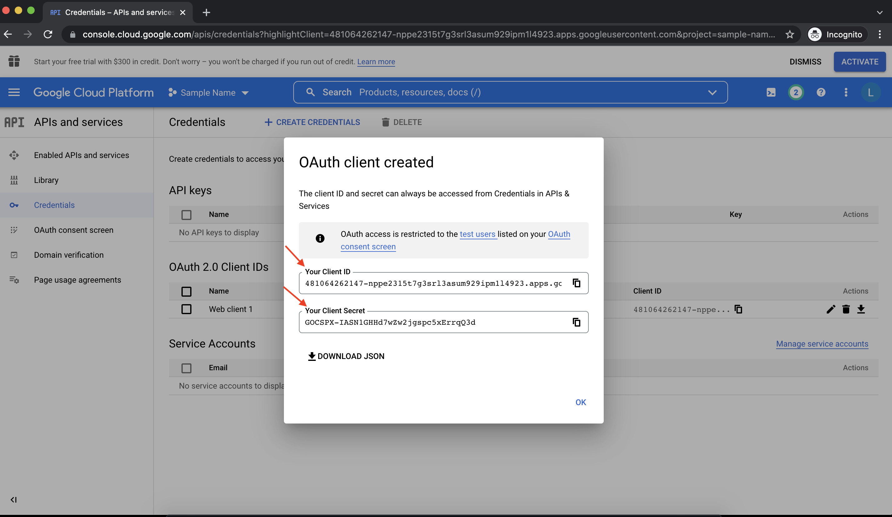
*Copy your Client ID and Client Secret*

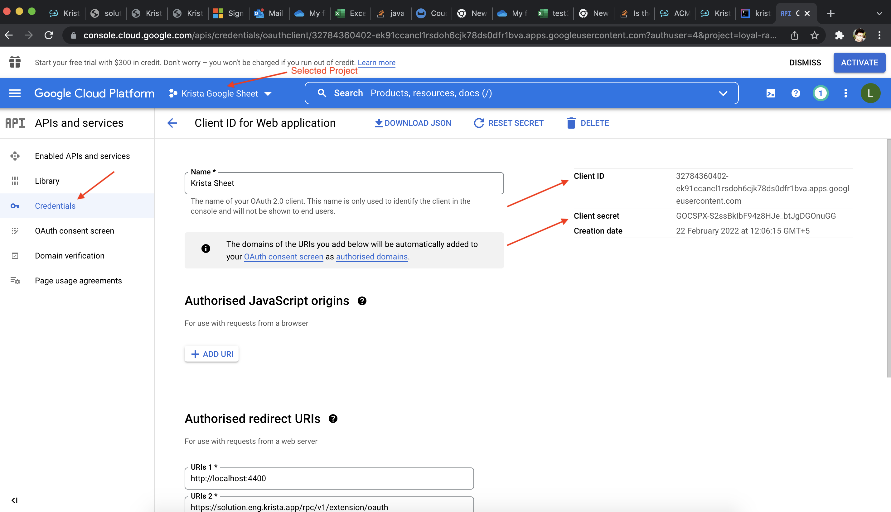
*Save your OAuth 2.0 credentials securely*

   - Click **"Download JSON"** to save credentials (optional but recommended)
   - Click **"OK"**

**⚠️ Important**: Store your Client Secret securely. You won't be able to view it again in the console (though you can regenerate it).

### Step 5: Configure Redirect URIs

Redirect URIs are critical for OAuth 2.0 security. They specify where Google can send users after authentication.

#### Determine Your Redirect URI

Your redirect URI must be the Gmail extension callback URL derived from the
**Extension Base URL** (also called Base Routing URL) shown in the extension
Details tab:
```
<Extension Base URL>/rest/gmail/callback
```

**Examples**:
- Extension Base URL: `https://automation.yourcompany.com/extensions/gmail-abc123`
  - Redirect URI: `https://automation.yourcompany.com/extensions/gmail-abc123/rest/gmail/callback`
- Extension Base URL: `https://krista.example.com/extensions/gmail-prod`
  - Redirect URI: `https://krista.example.com/extensions/gmail-prod/rest/gmail/callback`

#### Add Redirect URI to Google Cloud Console

1. Navigate to **"APIs & Services"** > **"Credentials"**
2. Click on your OAuth 2.0 Client ID
3. Under **"Authorized redirect URIs"**, click **"Add URI"**
4. Enter your redirect URI exactly as it appears in your Krista configuration
5. Click **"Save"**

#### Important Notes

- **Exact Match Required**: The URI must match exactly (protocol, domain, path, trailing slash)
- **HTTPS Required**: Production environments must use HTTPS
- **Multiple URIs**: You can add multiple URIs for different environments (dev, staging, production)
- **Localhost for Testing**: You can add `http://localhost:8080/oauth/callback` for local development

### Step 6: Verification

Verify your setup is correct:

1. **Check Enabled APIs**:
   - Navigate to **"APIs & Services"** > **"Dashboard"**
   - Confirm "Gmail API" is listed and enabled

2. **Check OAuth Consent Screen**:
   - Navigate to **"APIs & Services"** > **"OAuth consent screen"**
   - Verify app name, scopes, and test users (if applicable)

3. **Check Credentials**:
   - Navigate to **"APIs & Services"** > **"Credentials"**
   - Verify OAuth 2.0 Client ID is created
   - Verify redirect URIs are correct

4. **Test Credentials**:
   - Copy Client ID and Client Secret
   - Configure them in Krista Gmail Extension
   - Attempt authentication
   - Verify OAuth consent screen appears correctly

### Step 7: Publishing Your App (Optional)

If you're using "External" user type and want to remove the 7-day token expiration and 100 user limit:

1. Navigate to **"APIs & Services"** > **"OAuth consent screen"**
2. Click **"Publish App"**
3. Review the publishing requirements
4. Click **"Confirm"**

**Note**: Publishing may require Google verification if you're requesting sensitive or restricted scopes. The verification process can take several weeks.

**For Production Use**:
- Complete Google's verification process
- Provide privacy policy and terms of service
- Demonstrate legitimate use of requested scopes
- Maintain compliance with Google's policies

## Next Steps

After completing this setup:

1. **Configure Extension**: Use your Client ID and Client Secret in [Extension Configuration](pages/ExtensionConfiguration.md)
2. **Set Up Authentication**: Follow the [Authentication Guide](pages/Authentication.md) to complete OAuth flow
3. **Test Integration**: Execute a simple catalog request to verify everything works
4. **Review Security**: Implement [security best practices](pages/Authentication.md#security-best-practices)

## Troubleshooting

### Issue: "Gmail API not found in library"

**Cause**: Search filter or API availability issue

**Resolution**:
1. Clear search filters
2. Ensure you're in the correct project
3. Try direct link: https://console.cloud.google.com/apis/library/gmail.googleapis.com

### Issue: "Cannot create OAuth client"

**Cause**: OAuth consent screen not configured

**Resolution**:
1. Complete OAuth consent screen configuration first
2. Return to credentials creation
3. Ensure all required fields are filled

### Issue: "Redirect URI mismatch error during authentication"

**Cause**: Redirect URI in code doesn't match Google Cloud Console

**Resolution**:
1. Check exact URI in Google Cloud Console
2. Verify URI in Krista configuration matches exactly
3. Check for trailing slashes, protocol (https vs http)
4. Update either Google Cloud Console or Krista configuration to match

### Issue: "App is not verified" warning during authentication

**Cause**: App is in testing mode or not verified by Google

**Resolution**:
- **For Testing**: Click "Advanced" > "Go to [App Name] (unsafe)" to proceed
- **For Production**: Complete Google's verification process
- **Alternative**: Use "Internal" user type for Google Workspace organizations

## Security Considerations

1. **Protect Credentials**:
   - Never commit Client ID/Secret to version control
   - Use environment variables or secure vaults
   - Rotate credentials if compromised

2. **Limit Scopes**:
   - Only request scopes you actually need
   - Review scope requirements regularly
   - Remove unnecessary scopes

3. **Restrict Redirect URIs**:
   - Only add URIs you control
   - Use HTTPS in production
   - Remove unused URIs

4. **Monitor Usage**:
   - Review API usage in Google Cloud Console
   - Set up billing alerts
   - Monitor for unusual activity

## See Also

- [Extension Configuration](pages/ExtensionConfiguration.md)
- [Authentication Guide](pages/Authentication.md)
- [Google Cloud Console](https://console.cloud.google.com/)
- [Gmail API Documentation](https://developers.google.com/gmail/api)
- [OAuth 2.0 Documentation](https://developers.google.com/identity/protocols/oauth2)

---
*Documentation updated according to Krista Extension Documentation Guidelines*

