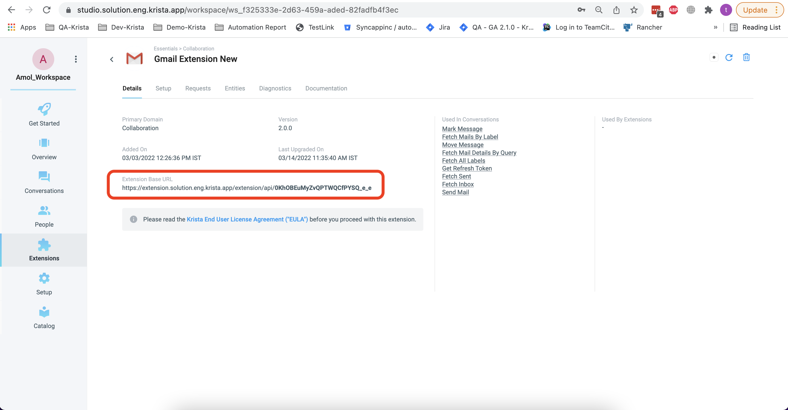
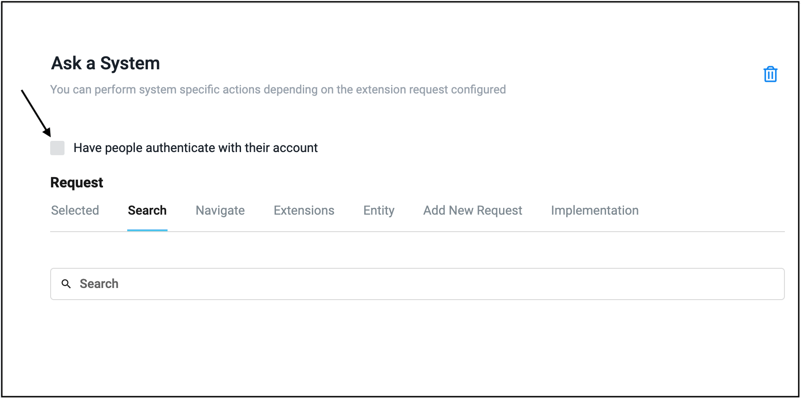
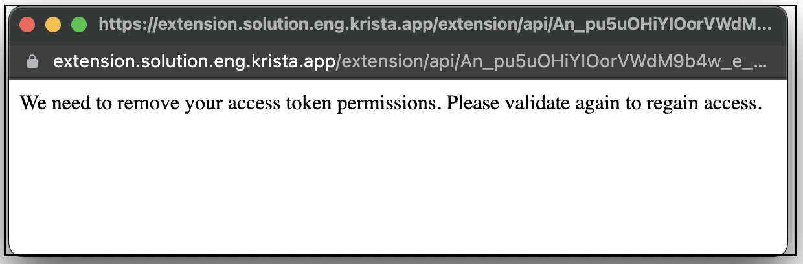

# Extension Configuration

## Overview

The Gmail Extension requires proper configuration to connect with Google's Gmail API and authenticate users. This guide provides comprehensive instructions for configuring the extension with OAuth 2.0 credentials, redirect URIs, and other essential parameters.

## Configuration Parameters

The following table lists all configuration parameters required to set up the Gmail Extension:

| Parameter | Type | Required | Description | Example |
|-----------|------|----------|-------------|---------|
| Client ID | Text | Yes | OAuth 2.0 client identifier from Google Cloud Console | "123456789.apps.googleusercontent.com" |
| Client Secret | Text | Yes | OAuth 2.0 client secret from Google Cloud Console | "GOCSPX-abc123def456" |
| Redirect URI | Auto-generated (read-only) | Yes (for Google Cloud Console) | Automatically constructed from the Extension Base URL; copy this value into Google Cloud Console as the Authorized redirect URI | "<Extension Base URL>/rest/gmail/callback" |
| Email | Text | Yes | Gmail email address for the authenticated user | "user@example.com" |
| Topic | Text | No | Google Cloud Pub/Sub topic for push notifications | "projects/myproject/topics/gmail-notifications" |
| Alert | Boolean | No | Enable/disable alert notifications | true |

## Step-by-Step Setup

### 1. Prerequisites

Before configuring the Gmail Extension, ensure you have:

- A Google Cloud project with Gmail API enabled
- OAuth 2.0 credentials (Client ID and Client Secret)
- Access to your Krista instance configuration
- Administrative privileges in Krista

### 2. Obtain OAuth 2.0 Credentials

If you haven't created OAuth 2.0 credentials yet, follow the [Creating Gmail App](pages/CreatingGmailApp.md) guide to:

1. Create a Google Cloud project
2. Enable the Gmail API
3. Configure the OAuth consent screen
4. Create OAuth 2.0 credentials
5. Obtain your Client ID and Client Secret

### 3. Configure Redirect URI

The redirect URI is the callback URL where Google will send users after authentication.
Krista automatically generates this value from the **Extension Base URL** configured for the Gmail extension.
For the Gmail extension it must be derived from the **Extension Base URL** shown on the
extension **Details** tab.

**Format**: `<Extension Base URL>/rest/gmail/callback`

**Example**: If your Extension Base URL is
`https://automation.yourcompany.com/extensions/gmail-abc123`, then your redirect URI is
`https://automation.yourcompany.com/extensions/gmail-abc123/rest/gmail/callback`.

**Important Notes**:
- The redirect URI must be registered in your Google Cloud Console OAuth 2.0 credentials
- The URI must use HTTPS in production environments
- The URI must exactly match what's configured in Google Cloud Console (including trailing slashes)

### 4. Configure Extension in Krista

1. Navigate to the Krista Extension Configuration page
2. Locate the Gmail Extension

*Configure the extension base routing URL in Krista*

3. Enter the following parameters:

   - **Client ID**: Paste the Client ID from Google Cloud Console
   - **Client Secret**: Paste the Client Secret from Google Cloud Console
   - **Redirect URI**: This value is automatically generated from the Extension Base URL shown on the
     Gmail extension **Details** tab and will be populated by Krista. You do not need to manually edit
     this field in the extension configuration. Use the generated value as the Authorized redirect URI
     when registering OAuth credentials in Google Cloud Console (append `/rest/gmail/callback`).
   - **Email**: Enter the Gmail email address to authenticate
   - **Topic** (Optional): Enter Pub/Sub topic for push notifications
   - **Alert** (Optional): Enable or disable alerts

> **Important:** Gmail push notifications and the **Trigger When New Email Arrived** catalog
> only work when **both** Topic and Alert are configured. If Topic is empty or Alert is not
> enabled, no Gmail watch will be created and you will not receive any new mail alerts from
> this extension.

*Set "Have System Authenticate" to false for user authentication*

*Enable "Have people authenticate with account" for OAuth 2.0 user authentication*

4. Save the configuration

### 5. Authentication Type Selection

The Gmail Extension supports OAuth 2.0 user authentication:

#### User Account Authentication

**When to Use**:
- Accessing individual user mailboxes
- User-specific email operations
- Delegated access scenarios

**How it Works**:
- Users authenticate with their Google account
- Extension acts on behalf of the authenticated user
- Access is limited to the user's mailbox

**Configuration**:
- Requires user consent during first authentication
- Tokens are stored securely per user
- Refresh tokens enable long-term access

### 6. Security Considerations

**Credential Protection**:
- Store Client ID and Client Secret securely
- Never expose credentials in client-side code
- Use environment variables or secure vaults for sensitive data

**Access Control**:
- Grant minimum required OAuth scopes
- Regularly review and audit access permissions
- Revoke unused or compromised tokens

**Network Security**:
- Always use HTTPS for redirect URIs in production
- Implement proper SSL/TLS certificates
- Validate redirect URI to prevent open redirect vulnerabilities

**Token Management**:
- Tokens are automatically refreshed before expiration
- Implement proper error handling for token refresh failures
- Monitor for suspicious authentication patterns

*Configure token expiry and revalidation settings*

### 7. Push Notification Configuration (Optional)

For real-time email notifications, configure Google Cloud Pub/Sub:

**Steps**:
1. Create a Pub/Sub topic in Google Cloud Console
2. Grant Gmail API permission to publish to the topic
3. Configure the topic name in the extension settings
4. Set up a subscription to receive notifications

**Topic Format**: `projects/<project-id>/topics/<topic-name>`

**Example**: `projects/my-gmail-project/topics/gmail-notifications`

### 8. Troubleshooting

#### Issue: "Invalid Client ID or Client Secret"

**Cause**: Incorrect credentials or credentials from wrong project

**Resolution**:
1. Verify Client ID and Client Secret from Google Cloud Console
2. Ensure credentials are from the correct project
3. Check for extra spaces or hidden characters
4. Regenerate credentials if necessary

#### Issue: "Redirect URI Mismatch"

**Cause**: Redirect URI doesn't match Google Cloud Console configuration

**Resolution**:
1. Verify redirect URI in Google Cloud Console
2. Ensure exact match including protocol (https://)
3. Check for trailing slashes
4. Update Google Cloud Console if needed

#### Issue: "Access Denied"

**Cause**: Insufficient OAuth scopes or user denied consent

**Resolution**:
1. Verify required scopes are configured
2. Re-authenticate to grant necessary permissions
3. Check OAuth consent screen configuration
4. Ensure user has necessary Gmail access

#### Issue: "Token Refresh Failed"

**Cause**: Refresh token expired or revoked

**Resolution**:
1. Re-authenticate the user
2. Check if user revoked access in Google Account settings
3. Verify OAuth consent screen is not in testing mode with expired tokens
4. Ensure refresh token is properly stored

## Verification

After configuration, verify the setup:

1. **Test Authentication**: Complete the OAuth flow successfully
2. **Test Basic Operation**: Execute a simple catalog request (e.g., Fetch All Labels)
3. **Check Logs**: Review extension logs for any errors
4. **Verify Permissions**: Ensure all required scopes are granted

## Next Steps

After successful configuration:

1. Review [Authentication](pages/Authentication.md) for detailed OAuth flow information
2. Explore [Email Operations](/#email-operations) to start automating
3. Set up [Push Notifications](pages/RenewSubscription.md) for real-time email events
4. Review [Known Issues](pages/KnownIssues.md) for common problems and solutions

## See Also

- [Authentication Guide](pages/Authentication.md)
- [Creating Gmail App](pages/CreatingGmailApp.md)
- [Gmail API Documentation](https://developers.google.com/gmail/api)
- [OAuth 2.0 Documentation](https://developers.google.com/identity/protocols/oauth2)

---
*Documentation updated according to Krista Extension Documentation Guidelines*

