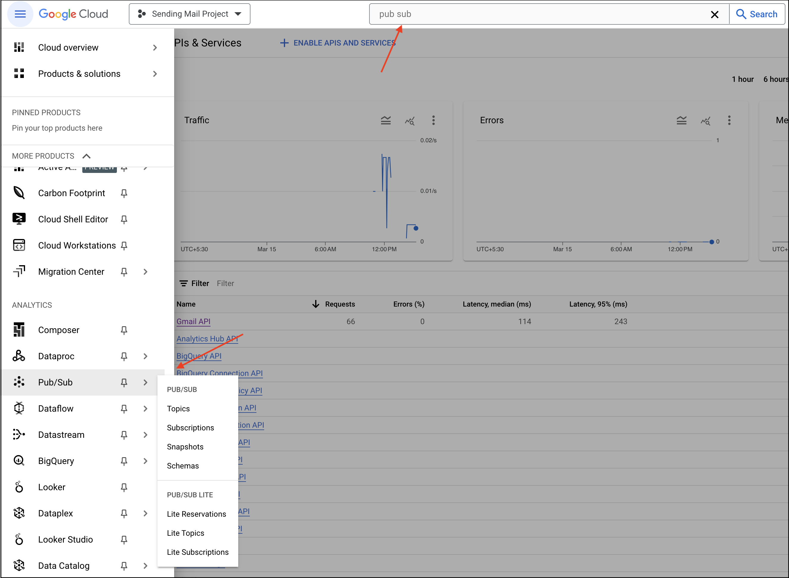
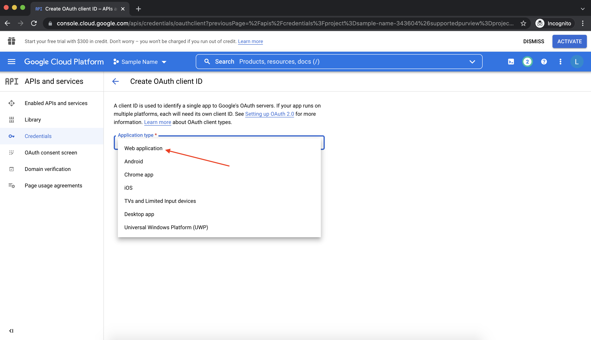
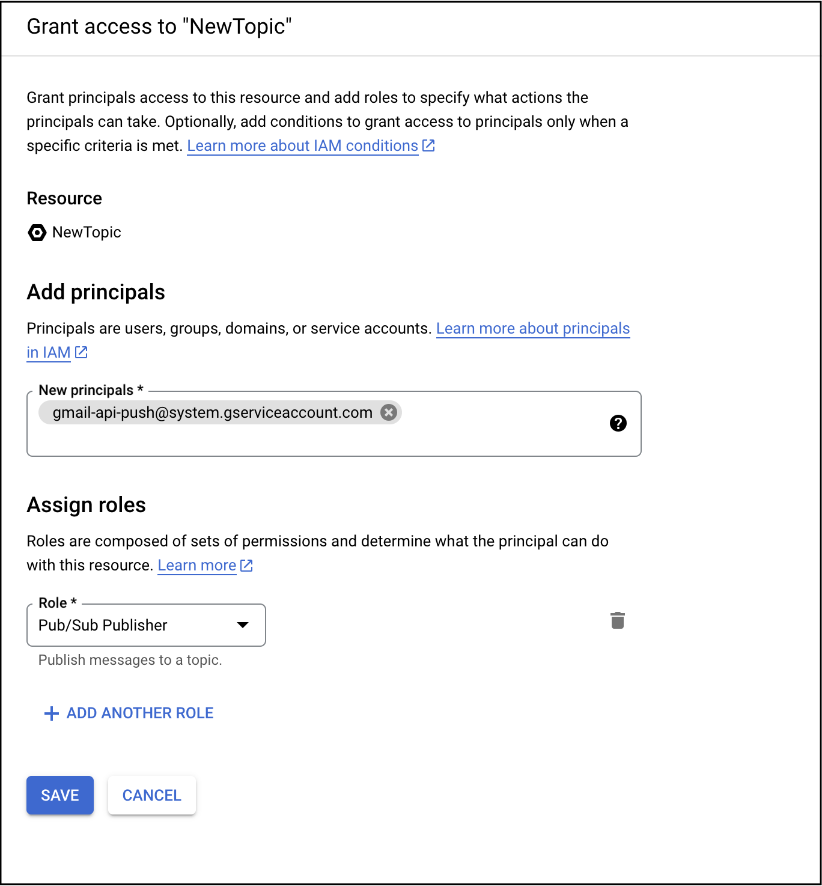
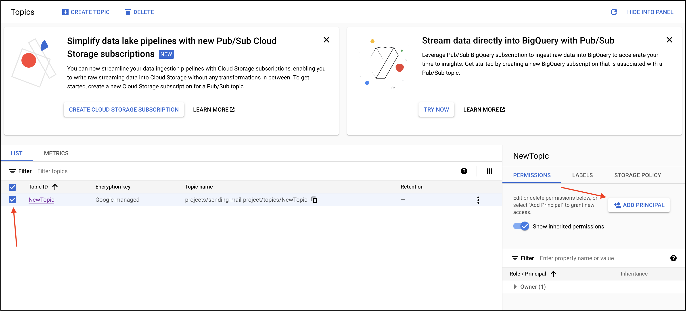
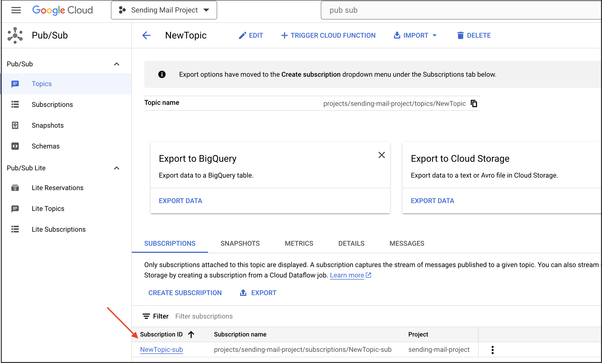
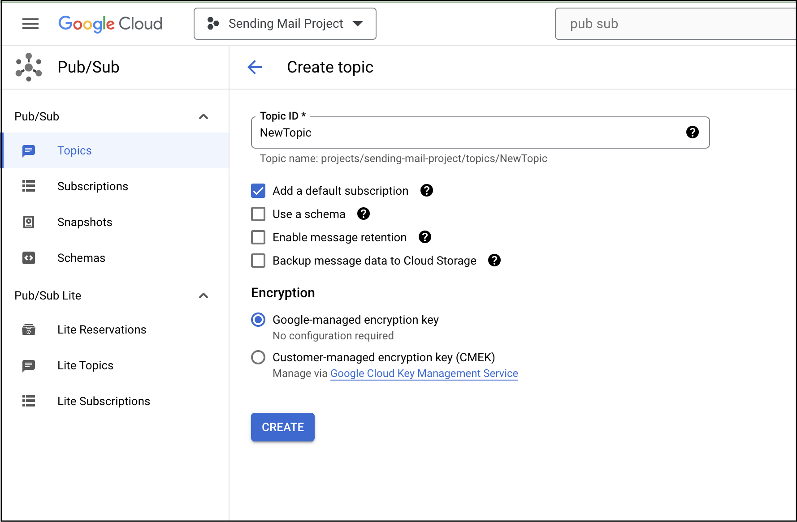
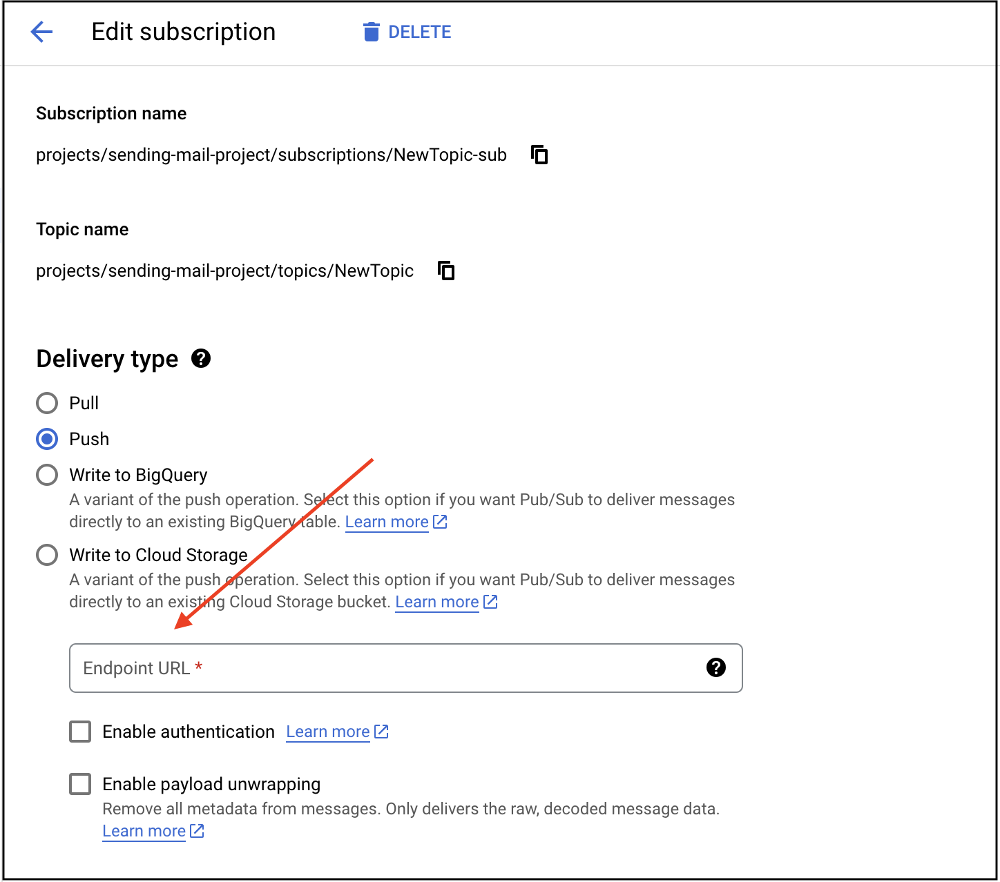

# Renew Subscription

## Overview

System-triggered catalog request that renews the Gmail notification subscription at specified intervals, ensuring continuous real-time email event notifications.

## Request Details

- **Area**: Messaging
- **Type**: CHANGE_SYSTEM
- **Retry Support**: ❌ No (system-triggered, no user input)

## Input Parameters

This catalog request requires no input parameters. It is automatically triggered by the system at scheduled intervals.

## Output Parameters

| Parameter Name | Type | Description |
|----------------|------|-------------|
| Success | Boolean | Indicates whether the subscription renewal was successful |

**Success Response**: `true`

**Failure Response**: System error response with details

## Validation Rules

No validation rules - this is a system-triggered request with no input parameters.

## Error Handling

### System Errors (SYSTEM_ERROR)

**Cause**: Gmail API errors, subscription renewal failures, or service unavailability

**Error Message**: "Error occurred while Renew Subscription"

**Common Scenarios**:
- Gmail API temporarily unavailable
- Network connectivity problems
- Google Cloud Pub/Sub configuration issues
- Topic or subscription configuration errors
- Permission issues
- API rate limits exceeded

**Resolution**:
1. Check network connectivity
2. Verify Gmail API is accessible
3. Verify Google Cloud Pub/Sub topic is configured correctly
4. Check extension configuration (Topic, Alert settings)
5. Ensure proper permissions for Pub/Sub
6. Retry the operation
7. Review logs for specific error details

### Authorization Errors (MustAuthorizeException)

**Cause**: User not authenticated or token expired

**Resolution**:
1. Complete OAuth authentication flow
2. Verify authentication credentials
3. Re-authenticate if token expired
4. Check OAuth scopes include gmail.readonly or gmail.modify

## Usage Examples

### Example 1: Successful Renewal

**Input**:
```
(No input - system triggered)
```

**Output**:
```json
{
  "Success": true
}
```

**Result**: Gmail notification subscription renewed successfully

**Logs**:
```
Subscription Renewal Started
After renewing subscription History ID: 12345678
After renewing subscription Expiration Date: 1728123456000
Subscription Renewal Completed
```

### Example 2: Renewal Failure

**Input**:
```
(No input - system triggered)
```

**Output**:
```json
{
  "error": {
    "type": "SYSTEM_ERROR",
    "message": "Error occurred while Renew Subscription"
  }
}
```

**Result**: Subscription renewal failed, requires investigation

## Business Rules

1. **Automatic Trigger**: System automatically triggers renewal at scheduled intervals
2. **7-Day Expiration**: Gmail subscriptions expire after 7 days
3. **Recommended Schedule**: Renew every 6 days to ensure continuous coverage
4. **History ID Update**: Updates stored history ID after successful renewal
5. **Expiration Tracking**: Logs new expiration timestamp
6. **No User Input**: Completely automated, no user interaction required

## Limitations

1. **Gmail API Limits**: Subject to Gmail API quotas and rate limits
2. **Subscription Duration**: Gmail subscriptions limited to 7-day maximum
3. **Pub/Sub Dependency**: Requires Google Cloud Pub/Sub configuration
4. **Topic Configuration**: Requires valid Pub/Sub topic in extension configuration
5. **Account Scope**: Renews subscription for authenticated user's account only
6. **Scope Requirements**: Requires `gmail.readonly` or `gmail.modify` OAuth scope
7. **Network Dependency**: Requires stable network connection

## Best Practices

### 1. Schedule Regular Renewals
Configure automatic renewal every 6 days to prevent subscription expiration.

### 2. Monitor Renewal Success
Track renewal success/failure and alert on failures.

### 3. Log Renewal Events
Log all renewal attempts with history ID and expiration details.

### 4. Implement Retry Logic
Implement retry mechanism for failed renewals.

### 5. Alert on Failures
Set up alerts for renewal failures to prevent notification gaps.

### 6. Verify Configuration
Ensure Google Cloud Pub/Sub topic and extension configuration are correct.

## Common Use Cases

### 1. Continuous Email Monitoring
```
Scenario: Maintain continuous real-time email notifications
Action: System automatically renews subscription every 6 days
Result: Uninterrupted email event notifications
```

### 2. Scheduled Maintenance
```
Scenario: Prevent subscription expiration through scheduled renewal
Action: Automated renewal task runs on schedule
Result: Subscription always active, no notification gaps
```

### 3. Subscription Recovery
```
Scenario: Recover from expired subscription
Action: Manual or automatic renewal triggered
Result: Email notifications resume
```

### 4. Multi-Account Management
```
Scenario: Manage subscriptions for multiple Gmail accounts
Action: Renewal triggered for each configured account
Result: All accounts maintain active subscriptions
```

### 5. Failover and Redundancy
```
Scenario: Ensure notification reliability
Action: Monitor and renew subscriptions proactively
Result: High availability for email notifications
```

## Related Catalog Requests

- [Trigger When New Email Arrived](pages/TriggerWhenNewEmailArrived.md) - Event-driven new email detection
- [Get Latest Mail](pages/GetLatestMail.md) - Event-driven latest email retrieval
- [Extension Configuration](pages/ExtensionConfiguration.md) - Configure Pub/Sub topic

## Technical Implementation

### Helper Class
- **Class**: MessagingArea
- **Package**: app.krista.extensions.essentials.collaboration.gmail.catalog
- **Service**: Delegates to gmailNotificationChannel.initiate() for subscription renewal
- **History ID Storage**: Updates historyIdStore with new history ID after renewal

### Gmail Notification Channel
- **Technology**: Google Cloud Pub/Sub
- **Subscription Duration**: 7 days maximum
- **Renewal Process**: Creates new watch request with Gmail API
- **Response**: WatchResponse with historyId and expiration

### Subscription Details
- **Watch Resource**: User's Gmail mailbox
- **Topic**: Configured Google Cloud Pub/Sub topic
- **Label Filtering**: Can be configured to watch specific labels
- **Event Types**: All mailbox changes (new emails, deletions, label changes)

### Telemetry Metrics
- **TELEMETRY_RENEW_SUBSCRIPTION**: Total number of renewal requests
- **Success Tracking**: Records successful renewals
- **Error Tracking**: Records renewal failures with error details

## Troubleshooting

### Issue: "Error occurred while Renew Subscription"

**Cause**: System error during renewal process

**Solution**:
1. Check network connectivity
2. Verify Gmail API is accessible
3. Review extension configuration:
   - Topic: Valid Google Cloud Pub/Sub topic
   - Alert: Configured alert settings
4. Check Google Cloud Pub/Sub topic exists and is accessible
5. Verify OAuth authentication is valid
6. Review logs for specific error message
7. Check API quotas and rate limits

### Issue: Subscription keeps expiring

**Cause**: Renewal not running on schedule or failing

**Solution**:
1. Verify renewal schedule is configured (every 6 days recommended)
2. Check renewal task is running
3. Review logs for renewal failures
4. Ensure system has continuous uptime
5. Implement monitoring and alerts for renewal failures

### Issue: History ID not updating

**Cause**: Renewal succeeding but history ID not stored

**Solution**:
1. Review logs for history ID after renewal
2. Check historyIdStore is functioning
3. Verify renewal completion logs
4. Review code for history ID storage logic

### Issue: Pub/Sub topic errors

**Cause**: Google Cloud Pub/Sub configuration issues

**Solution**:
1. Verify Pub/Sub topic exists in Google Cloud Console
2. Check topic name matches extension configuration
3. Verify service account has Pub/Sub permissions
4. Ensure topic is in correct Google Cloud project
5. Review Pub/Sub topic configuration

### Issue: Authentication errors during renewal

**Cause**: OAuth token expired or invalid

**Solution**:
1. Re-authenticate with Gmail
2. Verify OAuth scopes include gmail.readonly
3. Check token hasn't expired
4. Review authentication configuration
5. Ensure service account credentials are valid

### Issue: Renewal succeeds but events not received

**Cause**: Pub/Sub delivery or endpoint configuration issue

**Solution**:
1. Verify Pub/Sub push endpoint is configured correctly
2. Check endpoint is accessible from Google Cloud
3. Review Pub/Sub subscription configuration
4. Test endpoint connectivity
5. Check firewall rules allow Pub/Sub traffic

## Configuration Requirements

### Google Cloud Pub/Sub Setup

1. **Create Topic**: Create a Pub/Sub topic in Google Cloud Console


*Navigate to Pub/Sub in Google Cloud Console*


*Create a new Pub/Sub topic for Gmail notifications*


*Configure topic settings*

2. **Configure Permissions**: Grant Gmail API permission to publish to topic


*Add Gmail API service account as a principal*


*Grant Pub/Sub Publisher role to Gmail API*


*Complete the principal setup*

3. **Create Subscription**: Create push subscription pointing to your endpoint


*Create a push subscription*


*Configure subscription settings*


*Link subscription to the topic*


*Configure the push endpoint URL*

4. **Extension Configuration**: Set topic name in extension configuration

### Extension Configuration

Required configuration parameters:
- **Topic**: Full Pub/Sub topic name (e.g., `projects/my-project/topics/gmail-notifications`)
- **Alert**: Alert configuration for notifications
- **Email**: Gmail account email address

### Renewal Schedule

Recommended configuration:
- **Frequency**: Every 6 days (144 hours)
- **Buffer**: 1 day before expiration
- **Retry**: Retry failed renewals every hour
- **Alert**: Alert on 3 consecutive failures

## See Also

- [Extension Configuration](pages/ExtensionConfiguration.md)
- [Authentication Guide](pages/Authentication.md)
- [Creating Gmail App](pages/CreatingGmailApp.md)
- [Gmail Push Notifications](https://developers.google.com/gmail/api/guides/push)
- [Google Cloud Pub/Sub](https://cloud.google.com/pubsub/docs)
- [Trigger When New Email Arrived](pages/TriggerWhenNewEmailArrived.md)

---
*Documentation updated according to Krista Extension Documentation Guidelines*

